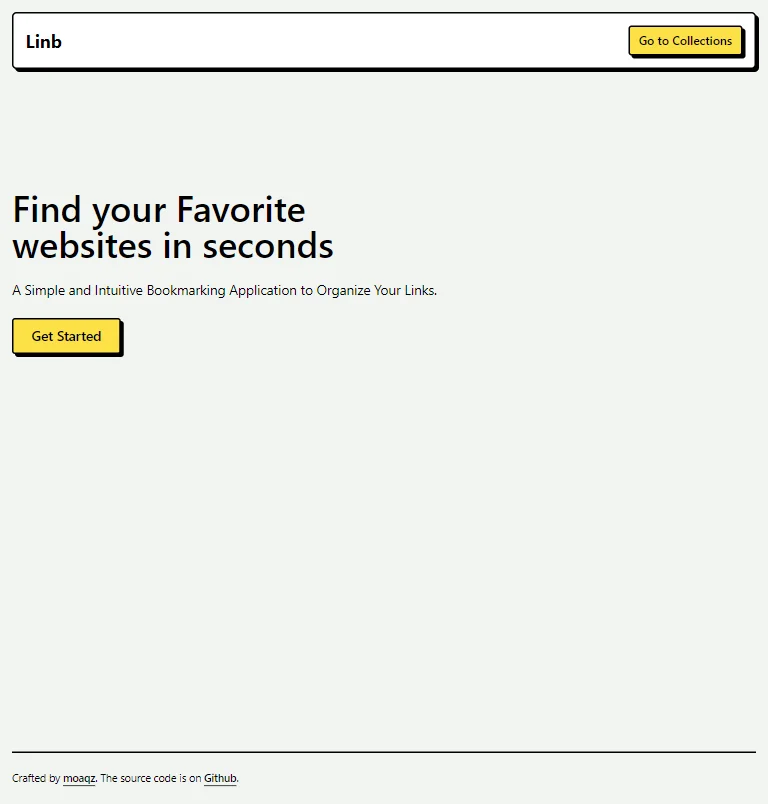
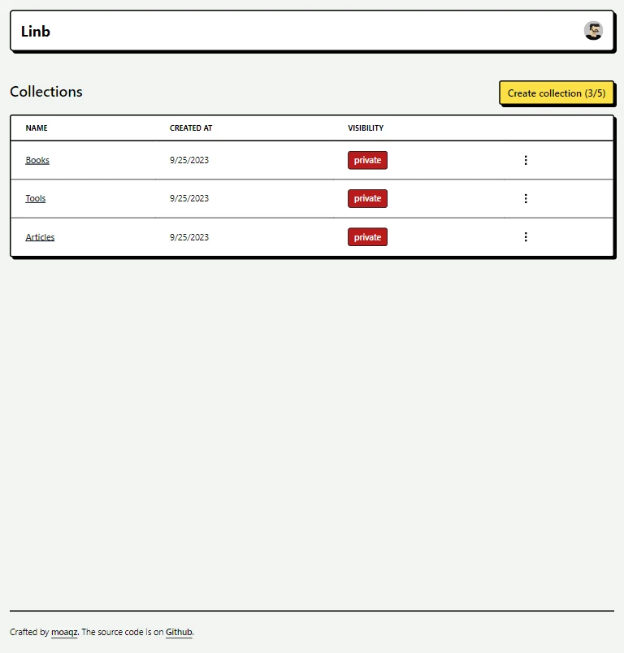
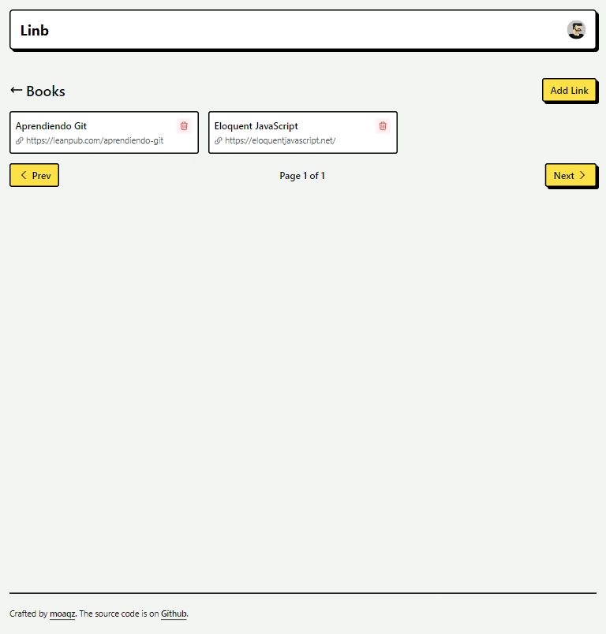

## Tech Stack

- [Next.js](https://nextjs.org/docs)
- [Clerk](https://clerk.com/)
- [Drizzle ORM](https://github.com/drizzle-team/drizzle-orm)
- [Neon](https://neon.tech/docs/introduction)

## Getting Started

Follow the below steps to run the app locally:

1. Create a database in [Neon](https://neon.tech/docs/get-started-with-neon/setting-up-a-project).
2. Create a [Clerk](https://clerk.com/docs/quickstarts/setup-clerk) application. 
3. Copy `.env.example` to `.env` and update the credentials.
4. Run `pnpm i`.
5. Generate a migration with `pnpm run db:generate`.
6. Run `pnpm dev` to open the app in development mode.

## Demo

